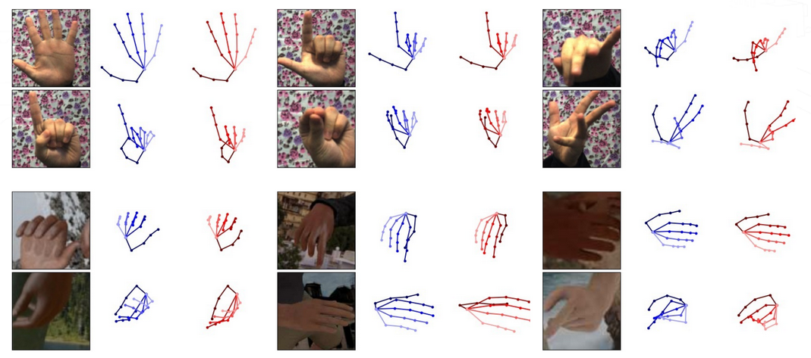

# Cross-Modal Deep Variational Hand Pose Estimation



[Project page](https://ait.ethz.ch/projects/2018/vae_hands/)

This repository provides a code base to evaluate the trained models of the paper [Cross-Modal Deep Variational Hand Pose Estimation](https://arxiv.org/abs/1803.11404) and reproduce the numbers of Table 2.
It is a modified version of the code found [here](https://github.com/lmb-freiburg/hand3d) by Christian Zimmermann, adapted to run our model. 


## Recommended system
Recommended system (tested):
- Ubuntu 16.04.2 (xenial)
- Python 3.5.2

Python packages used by the example provided and their recommended version:
- tensorflow==1.3.0
- numpy==1.14.5
- scipy==1.1.0
- matplotlib==1.5.3
- pytorch==0.3.1
- opencv-python==3.4.1.15

## Preprocessing for training and evaluation
In order to use the training and evaluation scripts you need download and preprocess the datasets.

### Rendered Hand Pose Dataset (RHD)

- Download the dataset [RHD dataset v. 1.1](https://lmb.informatik.uni-freiburg.de/resources/datasets/RenderedHandposeDataset.en.html)
- Extract it.
- In the file 'create_binary_db.py', set the variable 'path_to_db' to the path of the extracted dataset.
- Run
```
python create_binary_db.py
```
- This will create a binary file in *./data/bin* according to how 'set' was configured. Keep it at 'evaluation'.

### Stereo Tracking Benchmark Dataset (STB)
- To run the dataset on STB, it is neecessary to get the dataset presented in Zhang et al., ‘3d Hand Pose Tracking and Estimation Using Stereo Matching’, 2016
- The link to the dataset can be found [here](https://www.dropbox.com/sh/ve1yoar9fwrusz0/AAAfu7Fo4NqUB7Dn9AiN8pCca?dl=0)
- Unzip the dataset
- In 'create_db.m', set 'PATH_TO_DATASET' to the path of the extracted dataset
- Run
```
cd ./data/stb/
matlab -nodesktop -nosplash -r "create_db"
```
- This will create the binary file *./data/stb/stb_evaluation.bin*

### Trained models
- The trained models can be found [here](https://ait.ethz.ch/projects/2018/vae_hands/downloads/models.zip).
- After downloading the models, unzip it into the main project directory.

## Evaluation
- To reproduce the numbers of table 2, set the desired experimental settings in 'evaluate_model.py'. These correspond to the following parameters in the paper:

Paper  | Code
------------- | -------------
H  | hand_side_invariance
S  | scale_invariance

- Run
```
python evaluate_model.py
```
- This will create a folder named 'eval_results' in the respective model folder in which the PCK curve and some predictions are saved.


## License and Citation
This project is licensed under the terms of the GPL v2 license. By using the software, you are agreeing to the terms of the [license agreement](https://github.com/spurra/vae-hands-3d/blob/master/LICENSE).


If you use this code in your research, please cite us as follows:

```
@inproceedings{spurr2018cvpr,
    author = {Spurr, Adrian and Song, Jie and Park, Seonwook and Hilliges, Otmar},
    title = {Cross-modal Deep Variational Hand Pose Estimation},
    booktitle = {CVPR},
    year = {2018},
    location = {Salt Lake City, USA},
}
```
